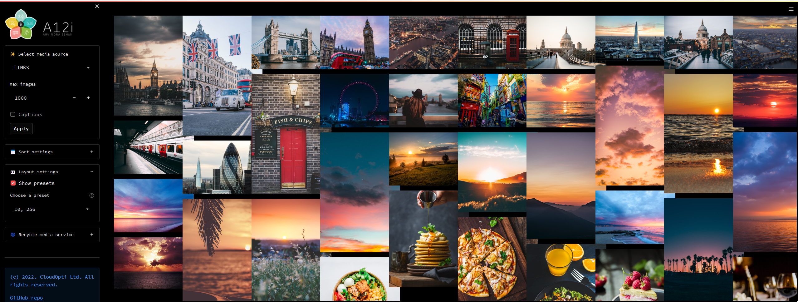

# Simple media service and Streamlit client app example

    date: "2022-06-30"
    author:
        name: "Arvindra Sehmi"
        url: "https://www.linkedin.com/in/asehmi/"
        mail: "vin [at] thesehmis.com"
        avatar: "https://twitter.com/asehmi/profile_image?size=original"
    related: https://github.com/asehmi/st-media-server is a similar FastAPI (client-server) version of this application

## Overview

This Streamlit app renders an image grid and provides some controls to sort and layout the grid.



### Try the demo app yourself

[](https://asehmi-st-media-service-client-app-01b2hx.streamlitapp.com/)

## Installation

```bash
$ cd st-media-service
$ pip install -r requirements.txt
```

## Usage

Run the included app to see how the Streamlit media service works:

```bash
$ streamlit run client_app.py
```

The demo client app is easily customised.

## Configuration

Media sources compatible with Streamlit's `st.image()` API are configured in `media_service.toml`. If this `toml` file isn't present the example `media_service.example.toml` is loaded instead. It should be obvious how to create your own service `toml` file. Note that two modes are supported, namely _local files_ (using the `media_folder` key) and _web links_ (using the `media_links` key). They are mutually exclusive and can't be intermixed.

Configure grid layout presets in `.streamlit/secrets.toml` (used by `client_app.py`). My screen width is 2560 pixels wide, so the presets provided are set according to this screen width.

**.streamlit/secrets.toml**

```bash
MAX_NUM_IMAGES = 3000
DEFAULT_NUM_IMAGES = 1000

# presets = Number of columns, Pixel width presets
# default_index = index of default to start with
[DISPLAY_PRESETS]
presets = [
    '1, 2560',
    '2, 1280',
    '3, 850',
    '4, 640',
    '5, 512',
    '10, 256',
    '20, 128',
    '40, 64'
]
default_index = 4
```

**media_service.toml**

```bash
# Singular values come above the key group values below to prevent them combining

# Singular values come above the key group values below to prevent them combining

MEDIA_TYPES = [
    'image/jpg',
    'image/jpeg',
    'image/png',
    'image/gif',
]

[MEDIA_SOURCES.'LOCAL 1']
media_folder = './images'
media_filter = 'unsplash'

[MEDIA_SOURCES.'LOCAL 2']
media_folder = './images'
media_filter = 'wallpaper'

[MEDIA_SOURCES.LINKS]
media_links = [
    'https://unsplash.com/photos/mOEqOtmuPG8/download?force=true&w=640',
    'https://unsplash.com/photos/g-krQzQo9mI/download?force=true&w=640',
    'https://unsplash.com/photos/Q6UehpkBSnQ/download?force=true&w=640',
    'https://unsplash.com/photos/iP8ElEhqHeY/download?force=true&w=640',
]
media_filter = 'unsplash'
```

If you update the media server `toml` whilst the client app is running, then restart/recycle the media server using the control provided in the client app.

---

If you enjoyed this app, please consider starring this repository.

Thanks!

Arvindra